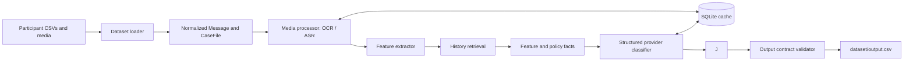
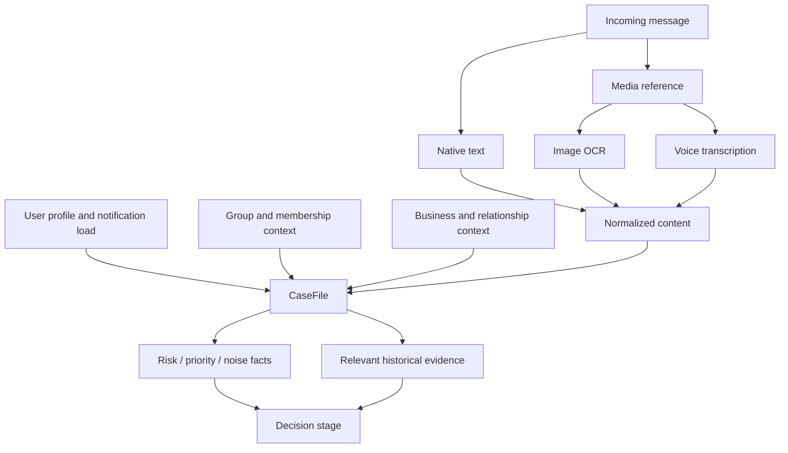
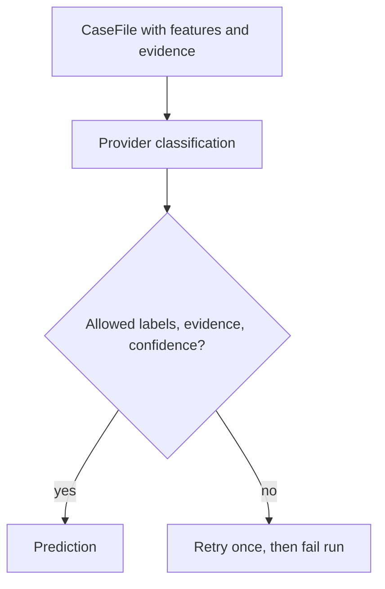
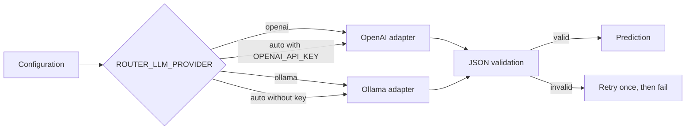
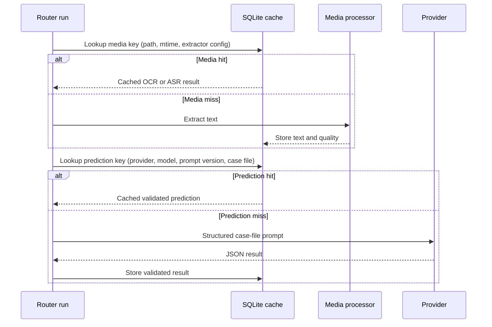
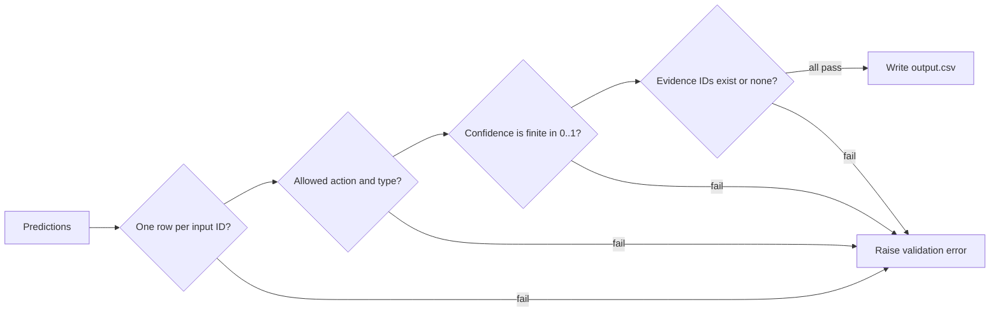

# Architecture Guide

This document describes the executable V2 router architecture. It complements
[.design.md](./.design.md), which records the design rationale, and
[DECISIONS.md](./DECISIONS.md), which tracks decisions still open to tuning.

## System purpose

The router assigns every incoming WhatsApp message one action:

- `notify` — interrupt now;
- `digest` — show later; or
- `mute` — suppress.

It produces a schema-validated `dataset/output.csv` and preserves the history
used as evidence for each decision.

## End-to-end flow



The provider consumes explicit safety, urgency, relationship, and noise facts
in a versioned case file. Schema validation is mandatory; an unavailable
provider fails before processing rather than silently changing policy.

## Component ownership

| Component | Responsibility | Durable output |
|---|---|---|
| `data_loader.py` | Read CSVs, normalize nulls/types, build indexes, create case files | In-memory indexes |
| `media_processor.py` | OCR image text and transcribe voice notes | Cached text and quality |
| `features.py` | Produce risk, priority, and noise/fatigue facts | Auditable case facts |
| `retrieval.py` | Select relevant prior messages and interaction outcomes | Evidence IDs and rationale |
| `prompting.py` | Define the versioned case-file prompt contract | `router-casefile-v3` |
| `providers.py` | Call OpenAI or Ollama and validate structured JSON | Cached predictions |
| `output_writer.py` | Enforce the evaluator’s output contract | `output.csv` |

## Case-file assembly



The `CaseFile` is the only object passed to a classifier. This keeps CSV join
logic, media extraction, and model prompting independent and testable.

## Classification policy



The prompt supplies safety facts but the provider owns the action decision. A
model result is rejected if its action/type is outside the allowed vocabulary,
its confidence is outside `[0, 1]`, or it cites an ID retrieval did not supply.

## Provider and fallback modes



`auto` supports judge execution when `OPENAI_API_KEY` is injected, while local
development can force Ollama without a cloud credential. Provider preflight is
required before a run.

## SQLite cache and resumability



Cache keys include the policy/model inputs, so a media update, model change, or
prompt version change automatically causes a safe cache miss. The cache is
ignored by Git and contains no credentials.

## Output contract and quality gates



Quality is checked at three levels:

1. Unit tests cover deterministic safety, evidence validation, and cache
   persistence.
2. The solved sample set reports action/type accuracy plus slices by
   conversation and expected type.
3. Final-output validation verifies all submission constraints before writing.

## Operational runbook

```bash
# Local Ollama run
ROUTER_LLM_PROVIDER=ollama .venv/bin/python -m code.main \
  --dataset-dir dataset --output dataset/output.csv

# Verify a provider before a long run
.venv/bin/python -m code.main --check-config --provider ollama

# Evaluate against solved examples
ROUTER_LLM_PROVIDER=ollama .venv/bin/python -m code.evaluation.main \
  --dataset-dir dataset --provider ollama
```

## Current limits and next work

- Retrieval is lexical and relationship-aware; add embeddings only after the
  current evidence audit shows a measurable need.
- The cache makes local runs resumable, but the provider is intentionally
  sequential to remain within the local 3–4 GB model budget.
- Solved-sample type accuracy remains weaker than action accuracy. Prioritize
  type-specific tuning for group messages and promotions, as recorded in
  `DECISIONS.md`.
