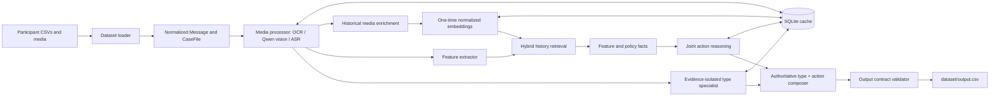
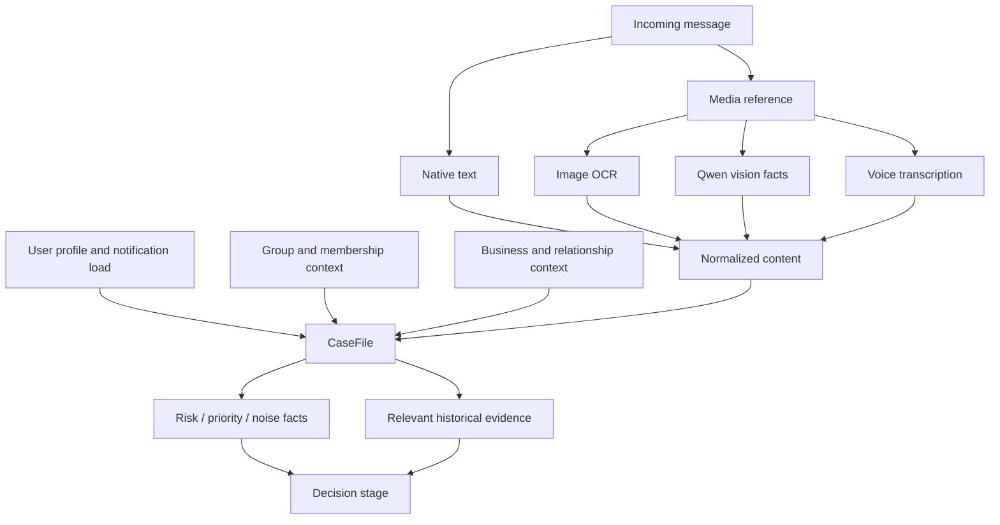
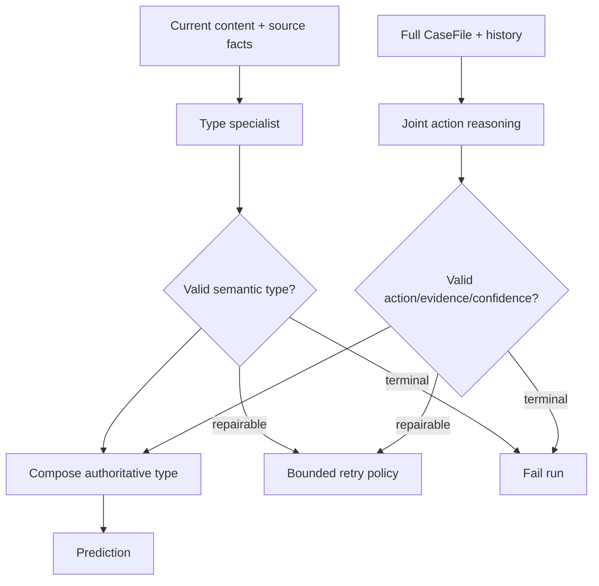
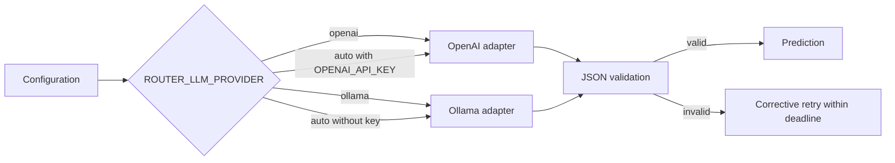
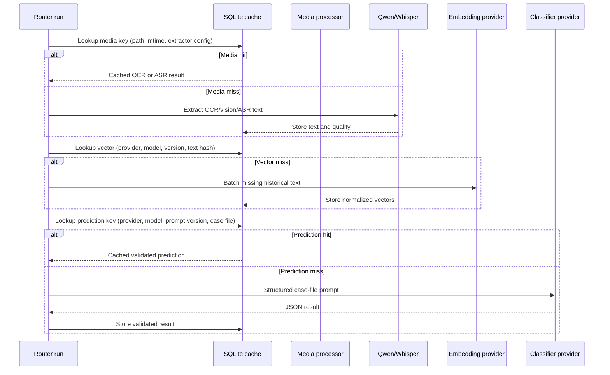
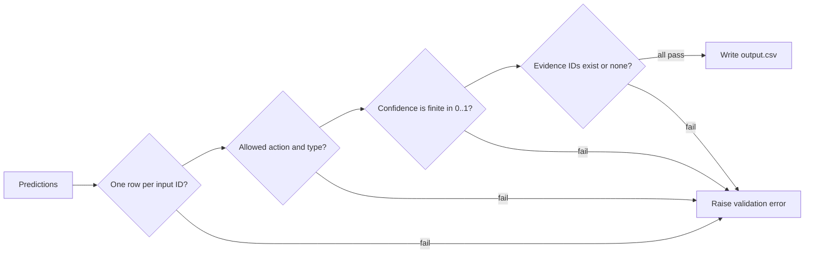
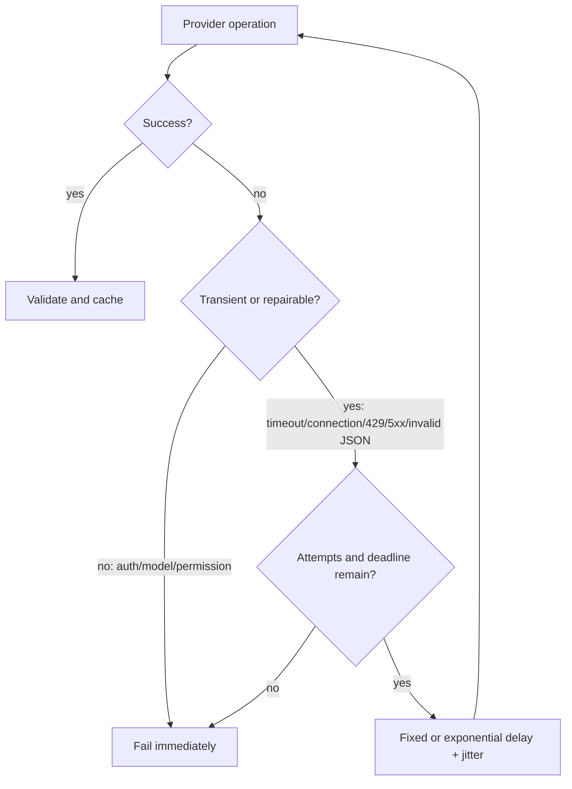

# Architecture Guide

This document describes the executable V8 router architecture. It complements
[.design.md](./.design.md), which records the design rationale, and
[DECISIONS.md](./DECISIONS.md), which tracks decisions still open to tuning.

## System purpose

The router assigns every incoming WhatsApp message one action:

- `notify` — interrupt now;
- `digest` — show later; or
- `mute` — suppress.

It produces a schema-validated `dataset/output.csv` and preserves the history
used as evidence for each decision.

## End-to-end flow



The provider consumes explicit safety, urgency, relationship, and noise facts
in a versioned case file. Schema validation is mandatory; an unavailable
provider fails before processing rather than silently changing policy.

## Component ownership

| Component | Responsibility | Durable output |
|---|---|---|
| `data_loader.py` | Read CSVs, normalize nulls/types, build indexes, create case files | In-memory indexes |
| `media_processor.py` | OCR + Qwen image facts; transcribe voice notes | Cached text and quality |
| `history_media.py` | Enrich historical messages before indexing | Retrievable media text |
| `embeddings.py` | Batch/cache normalized OpenAI or Ollama vectors | SQLite vectors |
| `features.py` | Produce risk, priority, and noise/fatigue facts | Auditable case facts |
| `retrieval.py` | Hybrid semantic/lexical/context/outcome ranker | Evidence IDs and rationale |
| `prompting.py` | Define isolated-type and joint-routing prompt contracts | Versioned prompts |
| `providers.py` | Cache type, route jointly, compose authoritative result | Cached types/predictions |
| `reliability.py` | Typed retries, backoff, jitter, deadlines | Safe error categories |
| `output_writer.py` | Enforce the evaluator’s output contract | `output.csv` |

## Case-file assembly



The `CaseFile` is the only object passed to a classifier. This keeps CSV join
logic, media extraction, and model prompting independent and testable.

## Classification policy



The provider owns both decisions, but the views differ deliberately. Historical
evidence text is excluded from type classification and included for action.
The joint stage's tentative type is discarded during composition. A result is
rejected if labels are outside the vocabulary, confidence is outside `[0, 1]`,
or it cites an ID retrieval did not supply.

## Provider and fallback modes



`auto` supports judge execution when `OPENAI_API_KEY` is injected, while local
development can force Ollama without a cloud credential. Provider preflight is
required before a run.

## SQLite cache and resumability



Cache keys include the policy/model inputs, so a media update, model change, or
prompt version change automatically causes a safe cache miss. The cache is
ignored by Git and contains no credentials.

## Output contract and quality gates



Quality is checked at three levels:

1. Unit tests cover deterministic safety, evidence validation, and cache
   persistence.
2. The solved sample set reports action/type accuracy plus slices by
   conversation and expected type.
3. Final-output validation verifies all submission constraints before writing.

## Operational runbook

```bash
# Local Ollama run
ROUTER_LLM_PROVIDER=ollama .venv/bin/python -m code.main \
  --dataset-dir dataset --output dataset/output.csv

# Optional explicit one-time index build (normal runs also ensure it exists)
ROUTER_LLM_PROVIDER=ollama .venv/bin/python -m code.index_history \
  --dataset-dir dataset

# Verify a provider before a long run
.venv/bin/python -m code.main --check-config --provider ollama

# Evaluate against solved examples
ROUTER_LLM_PROVIDER=ollama .venv/bin/python -m code.evaluation.main \
  --dataset-dir dataset --provider ollama
```

## Reliability flow



The provider SDKs have internal retries disabled so one policy owns attempt
counting. Logs contain message IDs, error class, attempt, and delay—never prompt
content or credentials. `ROUTER_RUN_DEADLINE_SECONDS=0` disables the optional
whole-run budget.

## Current limits and next work

- Hybrid weights need labeled evidence-precision calibration; SQLite avoids a
  vector-service dependency until corpus size demonstrates a need.
- The cache makes local runs resumable, but the provider is intentionally
  sequential to remain within the local 3–4 GB model budget.
- The five remaining solved-sample type misses are cross-category boundaries;
  calibrate them on a larger validation set rather than adding sample rules.
